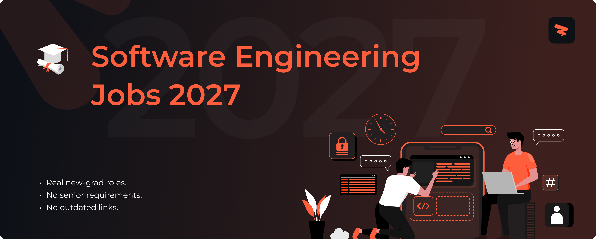

<!-- Cover -->

# Software Engineering Jobs 2027

🚀 Software engineering and IT jobs for new graduates, updated in real time.

> [!TIP]
> 🛠 Help us grow! Add new jobs by submitting an issue! View contributing steps [here](CONTRIBUTING-GUIDE.md).
---

## **Website & Autofill Extension**

Explore Zapply's website and check out:

- Our chrome extension that autofills your job applications in seconds.
- A dedicated job board with the latest jobs for various types of roles.
- User account providing multiple profiles for different resume roles.
- Job application tracking with streaks to unlock commitment awards.

Experience an advanced career journey with us! 🚀

  

## Explore Around

Connect and seek advice from a growing network of fellow students and new grads.

  
  &nbsp;&nbsp;
  
  &nbsp;&nbsp;
  

---

<h3>💻 <strong>Software Engineering</strong></h3>

| Company | Role | Location | Posted | Visa | **Apply** |
|---------|------|----------|--------|------|----------|
| **CrowdStrike** | Backend Engineer III, Falcon NG-SIEM,... | Austin, TX | 10m | 🏛 H-1B Co. |  |
| **Comcast** | GoLang Software Engineer, Identity Se... | Chicago, IL | 10m | 🏛 H-1B Co. |  |
| **Comcast** | Platform Engineer - Cyber Security | Philadelphia, PA | 10m | 🏛 H-1B Co. |  |
| **Curtiss-Wright** | Software Developer - Manufacturing an... | Summerville, SC | 10m | 🏛 H-1B Co. |  |
| **Wolters Kluwer** | Manager, Enterprise Software Engineering | New York City, NY | 11m |  |  |
| **Cisco** | Software Engineer I (Full Time) – Dev... | RTP, North Caroli... | 11m | 🏛 H-1B Co. |  |
| **Cisco** | Software Engineer, Embedded | Milpitas, Califor... | 11m | 🏛 H-1B Co. |  |
| **Cisco** | Software Engineer | San Jose, Califor... | 11m | 🏛 H-1B Co. |  |
| **Zoom** | Software Development Engineer | San Jose | 11m | 🏛 H-1B Co. |  |
| **Zoom** | Software Engineer | San Jose | 11m | 🏛 H-1B Co. |  |
| **Zoom** | Software Development Engineer | San Jose | 11m | 🏛 H-1B Co. |  |
| **State Street** | Software Engineering & Development-UI... | Austin, Texas | 11m | 🏛 H-1B Co. |  |
| **State Street** | Software Engineering & Development-Gl... | Boston, Massachus... | 11m | 🏛 H-1B Co. |  |
| **State Street** | Cloud Platform Engineer | Boston, Massachus... | 11m | 🏛 H-1B Co. |  |
| **T-Mobile** | Software Engineer | Bellevue Washingt... | 11m | 🏛 H-1B Co. |  |
| **Salesforce** | Software Engineering PMTS | San Francisco | 11m | 🏛 H-1B Co. |  |
| **RTX** | Assoc Software Engineer – Simulation | Binghamton, NY | 11m | 🏛 H-1B Co. |  |
| **RTX** | Software Engineer II (Onsite) | Cedar Rapids, IA | 11m | 🏛 H-1B Co. |  |
| **RTX** | Software Engineer II | Aurora, CO | 11m | 🏛 H-1B Co. |  |
| **Philips** | Automation Software Development Engineer | Cambridge (US), M... | 12m | 🏛 H-1B Co. |  |
| **NVIDIA** | System Software Engineer, Distributed... | US, CA, Santa Clara | 12m | 🏛 H-1B Co. |  |
| **Northrop Grumman** | Cyber Software Engineer | Virginia | 12m |  |  |
| **Northrop Grumman** | Java Software Engineer Level 5 | United States Col... | 12m |  |  |
| **Northrop Grumman** | Java Software Engineer Level 4 | United States Col... | 12m |  |  |
| **Nike** | Software Engineer | Beaverton, Oregon | 12m | 🏛 H-1B Co. |  |
| **Intel** | AI Software Development Engineer | Arizona Phoenix +... | 13m |  |  |
| **KBR** | Software Engineer - Junior Level | Aurora, Colorado | 13m | 🏛 H-1B Co. |  |
| **GDIT** | Full Stack Software Developer - TS/SC... | USA VA McLean | 13m | 🏛 H-1B Co. |  |
| **GDIT** | Software Engineer SME | USA HI Camp Smith | 13m | 🏛 H-1B Co. |  |
| **GDIT** | Full Stack Developer | USA MD West Bethesda | 13m |  |  |
| **CACI** | Software Developer | Bethesda, MD, US | 13m | 🏛 H-1B Co. |  |
| **CACI** | Full Stack Software Engineer | Santa Maria, CA, US | 13m | 🏛 H-1B Co. |  |
| **CACI** | Front End Developer - React | Austin, TX, US | 13m | 🏛 H-1B Co. |  |
| **Adobe** | AJO Platform Engineer | San Jose | 13m | 🏛 H-1B Co. |  |
| **Adobe** | Software Development Engineer | San Jose | 13m | 🏛 H-1B Co. |  |
| **Amentum** | Journeyman Software Engineer | Dahlgren, VA | 13m | 🏛 H-1B Co. |  |
| **Tesla** | Data Capture Engineering Intern - Dat... | Palo Alto, CA | 14m |  |  |
| **Tesla** | Software Engineer Intern - Software E... | Palo Alto, CA | 14m |  |  |
| **Tesla** | Embedded System Software Engineer Int... | Palo Alto, CA | 14m |  |  |
| **LexisNexis Risk Solutions** | Software Engineer Apprentice | United States | 14m |  |  |
| **Dover** | Software Engineer Intern | Brattleboro, VT | 14m |  |  |
| **Bank of America** | Global Tech Apprentice - Software Eng... | United States | 14m |  |  |
| **TikTok** | AI Software Engineer Intern - Transac... | San Jose, CA | 14m |  |  |
| **TikTok** | Backend Software Engineer Intern - Me... | San Jose, CA | 14m |  |  |
| **TikTok** | Software Engineer Intern - Monetizati... | San Jose, CA | 14m |  |  |
| **Gelber Group** | Software Engineer Intern - Technical ... | Chicago, IL | 14m | 🏛 H-1B Co. |  |
| **Skydio** | Software Engineer Intern | San Mateo, CA | 14m | 🏛 H-1B Co. |  |
| **Nokia** | Software Engineering Co-op | Sunnyvale, CA | 14m |  |  |
| **Nokia** | Software Development Co-op | Naperville, IL | 14m |  |  |
| **Skydio** | Middleware Software Engineer Intern | San Mateo, CA | 14m | 🏛 H-1B Co. |  |
| **Nokia** | Software Development Co-op | Sunnyvale, CA | 14m |  |  |
| **ByteDance** | Software Development Engineer Intern ... | San Jose, CA | 14m |  |  |
| **ByteDance** | Software Development Engineer Intern ... | Seattle, WA | 14m |  |  |
| **ByteDance** | Software Engineer Intern - Applied Ma... | San Jose, CA | 14m |  |  |
| **JP Morgan Chase** | Emerging Talent Software Engineer – C... | Chicago, IL | 14m |  |  |
| **John Deere** | Part-Time Student - Software Engineer... | Ames, IA | 14m |  |  |
| **Hunt Oil Company** | SAP BTP Application Developer Intern ... | Dallas, TX | 14m | 🏛 H-1B Co. |  |
| **Hunt Oil Company** | Software Engineer Intern - Summer 2026 | Dallas, TX | 14m | 🏛 H-1B Co. |  |
| **John Deere** | Part Time Student - Software Engineer... | Urbana, IL | 14m |  |  |
| **John Deere** | Part Time Student - Software Engineer | Ames, IA | 14m |  |  |
| **Fortinet** | Software Development - GenAI | Santa Clara, CA | 14m | 🏛 H-1B Co. |  |
| **Cox** | Software Engineering Intern | Burlington, VT | 14m |  |  |
| **Paccar** | Summer 2026 Intern   Application Deve... | Kirkland, WA | 14m |  |  |
| **BAE Systems** | Software Engineering Intern IV, Summe... | Nashua, NH | 14m |  |  |
| **BAE Systems** | Software Engineering Intern III, Summ... | Nashua, NH | 14m |  |  |
| **BAE Systems** | Software Engineering Intern II, Summe... | Nashua, NH | 14m |  |  |
| **Tessera Labs** | Software Engineering Intern, Frontend | United States | 14m | 🏛 H-1B Co. |  |
| **General Dynamics Mission Systems** | Entry Level Software Engineer | Manassas, VA | 14m |  |  |
| **X Development** | Full-Stack Software Engineer | Mountain View, CA | 14m |  |  |
| **Fortinet** | Junior Software Developer | Santa Clara, CA | 14m |  |  |
| **General Dynamics Mission Systems** | Software Engineer – Entry Level | Pittsfield, MA | 14m |  |  |
| **Boston Scientific** | Software Development - 1 - Engineering | Waltham, MA | 14m |  |  |
| **Corning** | Engineer – Automation Software Develo... | Elmira, NY | 14m |  |  |
| **General Dynamics Mission Systems** | Entry Level Software Engineer | Brooklyn, OH | 14m |  |  |
| **Woven** | Software Engineer - Calibration | Ann Arbor, MI | 14m |  |  |
| **McKesson** | Software Engineer - JavaScript / Ruby... | Columbus, OH | 14m |  |  |
| **PNC Financial Services** | Software Engineer | Pittsburgh, PA | 14m |  |  |
| **Pennsylvania State University** | Embedded Software Engineer | State College, PA | 14m |  |  |
| **Relay** | Software Engineer Associate - Embedde... | Raleigh, NC | 14m |  |  |
| **Relay** | Associate Software Engineer - Site Re... | Raleigh, NC | 14m |  |  |
| **Robert Bosch Venture Capital** | Rotational Development Program - Soft... | Southfield, MI | 14m |  |  |
| **Goldman Sachs** | Software Engineer - Data | United States | 14m |  |  |
| **LexisNexis Risk Solutions** | Software Engineer 1 | United States | 14m |  |  |
| **GM financial** | Software Development Engineer 1 | United States | 14m |  |  |
| **LexisNexis Risk Solutions** | Software Engineer 1 | United States | 14m |  |  |
| **EBSCO** | Cloud Platform Engineer I | Ipswich, MA | 14m |  |  |
| **CVS Health** | Associate Software Development Engineer | Richardson, TX | 14m |  |  |
| **Charles Schwab** | Associate Software Engineer | Lone Tree, CO | 14m |  |  |
| **Qualcomm** | GPU Kernel Development Engineer - Mul... | San Diego, CA | 14m |  |  |
| **Westinghouse Electric Company** | IT Software Engineer Analyst | Palm Beach Garden... | 14m |  |  |
| **Northwestern Mutual** | Software Engineer | Greendale, WI | 14m |  |  |
| **Citadel Securities** | Software Engineer – University Gradua... | Miami, FL | 14m |  |  |
| **GM financial** | Software Development Engineer 1 | Arlington, TX | 14m |  |  |
| **Thermo Fisher Scientific** | Scientist III, Software Engineer, Ups... | Grand Island, New... | 27m | 🏛 H-1B Co. |  |
| **Magna** | Full Stack Developer | Brampton, Ontario... | 27m | 🏛 H-1B Co. |  |
| **Micron Technology** | TDIT Software Engineer | Boise, ID - Main ... | 28m | 🏛 H-1B Co. |  |
| **Micron** | TDIT Software Engineer | Boise, ID - Main ... | 28m | 🏛 H-1B Co. |  |
| **IDEXX** | Software Developer II | Westbrook, ME + 6... | 28m | 🏛 H-1B Co. |  |
| **Booz Allen Hamilton** | Software Developer | Fayetteville, NC | 28m | 🏛 H-1B Co. |  |
| **Booz Allen Hamilton** | .NET Software Engineer | Arlington, VA + 1... | 28m | 🏛 H-1B Co. |  |

Apply for more jobs at

<h3>🤖 <strong>AI / ML Engineering</strong></h3>

| Company | Role | Location | Posted | Visa | **Apply** |
|---------|------|----------|--------|------|----------|
| **Cotiviti** | Generative AI Research Engineer Intern | United States | 14m |  |  |
| **Citadel Securities** | Quantitative Research Engineer – PhD ... | Miami, FL | 14m | 🏛 H-1B Co. |  |
| **ByteDance** | AI Vision Research Engineer Graduate ... | San Jose, CA | 14m |  |  |
| **ByteDance** | Graduate Research Engineer - Seed Infra | Seattle, WA | 14m |  |  |
| **TikTok** | Research Engineer/Scientist (all leve... | San Jose, California | 24m | 🏛 H-1B Co. |  |
| **TikTok** | Operation Research Engineer- TikTok E... | Seattle, Washington | 24m | 🏛 H-1B Co. |  |
| **TikTok** | Research Engineer/Scientist (all leve... | San Jose, California | 24m | 🏛 H-1B Co. |  |
| **ByteDance** | Research Engineer Graduate (Agent Sys... | Seattle, Washington | 24m | 🏛 H-1B Co. |  |
| **Google** | Research Engineer, Agentic Security &... | United States | 28m | 🏛 H-1B Co. |  |
| **Google** | Technical Program Manager III, Machin... | United States | 28m | 🏛 H-1B Co. |  |
| **Google** | Research Engineer, Pretraining, DeepMind | United States | 28m | 🏛 H-1B Co. |  |
| **Leidos** | Space Radiation Research Engineer (NA... | Houston, TX | 1h | 🏛 H-1B Co. |  |
| **Schweitzer Engineering Laboratories** | Associate Research Engineer | Pullman | 1h | 🏛 H-1B Co. |  |
| **Boston Dynamics** | Teleoperations Research Engineer, Atlas | Waltham | 2h | 🏛 H-1B Co. |  |
| **Boston Dynamics** | Research Engineer, Atlas Physics Simu... | Waltham | 2h | 🏛 H-1B Co. |  |
| **Airbnb** | Machine Learning Engineer, Community ... | San Francisco, CA | 15h | ✅ Sponsor |  |
| **Bosch Group** | AI Research Engineer – Agentic AI | Sunnyvale, CA | 16h | 🏛 H-1B Co. |  |
| **Esri** | Technical Consultant – Enterprise Dat... | Redlands, CA | 19h | ✅ Sponsor |  |
| **Esri** | Technical Consultant – Enterprise Dat... | Vienna, Virginia,... | 19h | ✅ Sponsor |  |
| **Esri** | Technical Consultant – Enterprise Dat... | St. Louis, MO - G... | 19h | ✅ Sponsor |  |
| **Snowflake** | Forward Deployed Engineer – Data Engi... | Menlo Park, CA | 1d | ✅ Sponsor |  |
| **Intuitive** | Computer Vision Engineering Intern - ... | Sunnyvale, CA | 1d | 🏛 H-1B Co. |  |
| **Intuitive** | Clinical Research Engineer - Future F... | Sunnyvale, CA | 1d | 🏛 H-1B Co. |  |
| **Autodesk** | Research Engineer | San Francisco, CA... | 2d | 🏛 H-1B Co. |  |
| **OpenAI** | Research Engineer / Research Scientis... | San Francisco | 4d | ✅ Sponsor |  |
| **Anthropic** | Research Engineer, Domain Scaling | San Francisco, CA... | 4d | ✅ Sponsor |  |
| **Zoox** | Data Scientist - Mapping | Foster City, CA | 5d | 🏛 H-1B Co. |  |
| **Intuitive** | Manager, Clinical Research Engineering | Sunnyvale, CA | 5d | 🏛 H-1B Co. |  |
| **CACI** | Artificial Intelligence & Cloud Engineer | Norfolk, VA, US | 6d | 🏛 H-1B Co. |  |
| **Booz Allen Hamilton** | Cybersecurity AI/ML Engineer | McLean, VA | 6d | 🏛 H-1B Co. |  |
| **Booz Allen Hamilton** | Cybersecurity Data Scientist | McLean, VA | 6d | 🏛 H-1B Co. |  |
| **Together AI** | Systems Research Engineer Intern - GP... | San Francisco | 1w | ✅ Sponsor |  |
| **Campbell Soup Company** | Data Engineer – Agentic AI & ML Ops (... | NJ | 1w | 🏛 H-1B Co. |  |
| **Rivian and Volkswagen Group Technologies** | Data Engineering Intern - AI & Analyt... | Palo Alto, Califo... | 2w | ✅ Sponsor |  |
| **d-Matrix** | Applied AI Engineering Intern | Santa Clara | 3w | ✅ Sponsor |  |
| **NREL** | Graduate (Year-Round) Intern: Geospat... | Golden, CO + 1 more | 3w |  |  |
| **CrowdStrike** | GenAI Engineering Intern  - SkillBrid... | Remote | 1mo | 🏛 H-1B Co. |  |
| **Marmon Holdings** | Data Engineering Intern OR Student Co-Op | Milwaukee, WI | 1mo |  |  |
| **PlusAI** | Research Engineer Intern - Mapping & ... | Santa Clara, CA | 1mo | 🏛 H-1B Co. |  |
| **PlusAI** | Research Engineer Intern | Santa Clara, CA | 1mo | 🏛 H-1B Co. |  |
| **Sunwater Capital** | Fall Data Engineering Intern - Congre... | North Bethesda, MD | 1mo | ✅ Sponsor |  |
| **PlusAI** | Research Engineer Intern - Control | Santa Clara, CA | 1mo | 🏛 H-1B Co. |  |
| **Human Computer Lab** | Intern - Software/ML Engineering | San Francisco | 2mo | ✅ Sponsor |  |

Apply for more jobs at

<h3>🔒 <strong>Infrastructure & Security</strong></h3>

| Company | Role | Location | Posted | Visa | **Apply** |
|---------|------|----------|--------|------|----------|
| **Comcast** | Engineer 1, Network Engineering | Philadelphia, PA | 10m | 🏛 H-1B Co. |  |
| **Cigna** | Infrastructure Engineering Advisor - ... | Bloomfield, CT + ... | 11m | 🏛 H-1B Co. |  |
| **Cisco** | Information Security Engineer II (Ful... | RTP, North Caroli... | 11m | 🏛 H-1B Co. |  |
| **Clarivate** | Cyber Security Engineer-Vulnerability... | R244-Kansas City | 11m |  |  |
| **Clarivate** | Cyber Security Engineer | R244-Kansas City | 11m |  |  |
| **Zoom** | AI Infrastructure Engineer | Seattle | 11m | 🏛 H-1B Co. |  |
| **Zoom** | SRE - Linux Administration | San Jose | 11m | 🏛 H-1B Co. |  |
| **Zoom** | Software QA Engineer | San Jose | 11m | 🏛 H-1B Co. |  |
| **State Street** | Cybersecurity | Boston, Massachus... | 11m | 🏛 H-1B Co. |  |
| **State Street** | Cybersecurity | Boston, Massachus... | 11m | 🏛 H-1B Co. |  |
| **T-Mobile** | Software Reliability Engineer | Atlanta, Georgia | 11m | 🏛 H-1B Co. |  |
| **T-Mobile** | Manager, Cybersecurity - Process and ... | Overland Park Kan... | 11m | 🏛 H-1B Co. |  |
| **RTX** | Linux HPC System Administrator (Remote) | Remote, OH | 11m | 🏛 H-1B Co. |  |
| **RTX** | System Administrator Internship - Fal... | Cambridge, MA | 11m | 🏛 H-1B Co. |  |
| **RTX** | Automation Engineer (Onsite) | Asheville, NC | 11m | 🏛 H-1B Co. |  |
| **Radiance Technologies** | System Administrator | Huntsville, AL | 12m |  |  |
| **Medtronic** | Systems Administrator - ACM | Mounds View, Minn... | 12m | 🏛 H-1B Co. |  |
| **Northrop Grumman** | Industrial Security Analyst 2/3 | Florida | 12m |  |  |
| **Northrop Grumman** | Software Test Engineer | California | 12m |  |  |
| **Northrop Grumman** | Industrial Security Analyst | California | 12m |  |  |
| **KBR** | Systems Administrator | Lexington Park, M... | 13m | 🏛 H-1B Co. |  |
| **KBR** | Cloud DevOps 4 | Sioux Falls, Sout... | 13m | 🏛 H-1B Co. |  |
| **Guidehouse** | Identity & Cloud Engineer (Multi-Clou... | GA Atlanta + 2 more | 13m | 🏛 H-1B Co. |  |
| **ICF** | Network Engineer - (US only) | Reston, VA | 13m | 🏛 H-1B Co. |  |
| **GDIT** | Cyber Security Manager | USA VA Falls Church | 13m | 🏛 H-1B Co. |  |
| **GDIT** | Systems Administrator | USA VA Norfolk | 13m | 🏛 H-1B Co. |  |
| **GDIT** | Information Assurance Security Engineer | VA Springfield + ... | 13m | 🏛 H-1B Co. |  |
| **Fiserv** | Infrastructure Engineer | Berkeley Heights,... | 13m | 🏛 H-1B Co. |  |
| **Fiserv** | IaC Automation Engineer | Alpharetta Georgi... | 13m | 🏛 H-1B Co. |  |
| **CACI** | Systems Administrator - CSfC | Fort Bragg, NC, US | 13m | 🏛 H-1B Co. |  |
| **CACI** | Network Security Analyst | Chantilly, VA, US | 13m | 🏛 H-1B Co. |  |
| **CACI** | Cloud Engineer | Chantilly VA US +... | 13m | 🏛 H-1B Co. |  |
| **Boeing** | Advanced Information Technologist – A... | Hazelwood, MO | 13m | 🏛 H-1B Co. |  |
| **Boeing** | Cybersecurity - Information System Se... | Herndon, VA | 13m | 🏛 H-1B Co. |  |
| **Boeing** | Ground Cybersecurity Assessment Speci... | Chantilly, VA | 13m | 🏛 H-1B Co. |  |
| **Amentum** | Network Analyst/System Administrator II | Arlington, VA | 13m | 🏛 H-1B Co. |  |
| **Amentum** | Data Security Analyst | Remote | 13m | 🏛 H-1B Co. |  |
| **Trace3** | DevOps | United States | 14m | ✅ Sponsor |  |
| **ByteDance** | Security Engineering Project - Watermark | San Jose, CA | 14m |  |  |
| **TikTok** | Cybersecurity Resilience Specialist (... | New York, New York | 24m | 🏛 H-1B Co. |  |
| **TikTok** | Site Reliability Engineer, Global E-c... | San Jose, California | 24m | 🏛 H-1B Co. |  |
| **TikTok** | Network Engineer, Global BackBone | Seattle, Washington | 24m | 🏛 H-1B Co. |  |
| **ByteDance** | Site Reliability Engineer Intern (Dat... | San Jose, California | 24m | 🏛 H-1B Co. |  |
| **ByteDance** | Site Reliability Engineer Project Int... | San Jose, California | 24m | 🏛 H-1B Co. |  |
| **Thermo Fisher Scientific** | Automation Engineer III | Greenville, North... | 27m | 🏛 H-1B Co. |  |
| **Magna** | Controls & Automation Engineer | Concord, Ontario, CA | 27m | 🏛 H-1B Co. |  |
| **Booz Allen Hamilton** | Cybersecurity Analyst, Mid | Rome, NY | 28m | 🏛 H-1B Co. |  |
| **Booz Allen Hamilton** | Security Engineering Technician | Camp Pendleton, CA | 28m | 🏛 H-1B Co. |  |
| **Booz Allen Hamilton** | Endpoint Security Engineer | Indianapolis, IN ... | 28m | 🏛 H-1B Co. |  |
| **Google** | Cloud Platforms and Infrastructure En... | United States | 28m | 🏛 H-1B Co. |  |
| **Google** | Security Engineer, Cloud Red Team, Cl... | United States | 28m | 🏛 H-1B Co. |  |
| **Google** | Security Engineer, Insider and Techno... | United States | 28m | 🏛 H-1B Co. |  |
| **Leidos** | Cloud Infrastucture & DevOps Engineer | Shiloh, IL | 1h | 🏛 H-1B Co. |  |
| **Leidos** | Cloud Infrastucture & DevOps Engineer | Shiloh, IL | 1h | 🏛 H-1B Co. |  |
| **Leidos** | Cloud Engineer | Washington, DC | 1h | 🏛 H-1B Co. |  |
| **Blackstone** | 2024 Blackstone Technology and Innova... | Miami | 1h | 🏛 H-1B Co. |  |
| **FOX** | Media DevOps Engineer | Los Angeles Calif... | 1h | 🏛 H-1B Co. |  |
| **Allstate** | Digital Product Manager - Cybersecuri... | Remote | 1h |  |  |
| **Schweitzer Engineering Laboratories** | Power Systems Automation Engineer | Georgia Columbus ... | 1h | 🏛 H-1B Co. |  |
| **Schweitzer Engineering Laboratories** | Automation Engineer | Boise | 1h | 🏛 H-1B Co. |  |
| **Schweitzer Engineering Laboratories** | Integration & Automation Engineer - I... | Charlotte | 1h | 🏛 H-1B Co. |  |
| **AssetMark** | Security Engineer II | Atlanta, GA + 1 more | 2h |  |  |
| **Altera** | Network Engineer | San Jose, Califor... | 2h | 🏛 H-1B Co. |  |
| **Aerospace Corporation** | Aerospace Software Test Engineer | El Segundo, CA | 2h |  |  |
| **Verizon** | Vulnerability Management Engineer | Temple Terrace Fl... | 2h |  |  |
| **Brown & Brown Insurance** | Business Information Security Officer | Daytona Beach, FL... | 2h |  |  |
| **Jabil** | Project/Automation Engineer II | Devens, MA | 3h | 🏛 H-1B Co. |  |
| **Sierra Nevada Corporation** | Voice Network Engineer II | Lone Tree, CO + 1... | 9h |  |  |
| **Snap** | Security Engineer, Level 4 | Los Angeles Calif... | 9h |  |  |
| **Snap** | Security Engineer, Level 5, Detection... | Los Angeles Calif... | 9h |  |  |
| **Snap** | DevOps Engineer, Level 4 | Los Angeles, Cali... | 9h |  |  |
| **Base Power** | Infrastructure Engineer, Distributed ... | Austin, TX | 13h | ✅ Sponsor |  |
| **Cerebras Systems** | Network Security Engineer | Remote, Californi... | 19h |  |  |
| **Cerebras Systems** | Hardware / Low Level Security Engineer | Remote, Californi... | 19h |  |  |
| **Per Scholas** | Technical Instructor (Cybersecurity) | Chicago, Illinois... | 21h | ✅ Sponsor |  |
| **Ginkgo Bioworks** | Automation Engineer 1, Automation Sup... | Boston, Massachus... | 22h | 🏛 H-1B Co. |  |
| **Tanium** | IT Infrastructure Engineer | Addison, TX (Hybr... | 1d | ✅ Sponsor |  |
| **JPMorgan Chase** | Infrastructure Engineer II - Managed ... | OH, United States | 1d | 🏛 H-1B Co. |  |
| **JPMorgan Chase** | Infrastructure Engineer III - MQ Series | Plano, TX, United... | 1d | 🏛 H-1B Co. |  |
| **Texas Instruments** | DevOps Engineer – Semiconductor EDA T... | Dallas, TX, Unite... | 1d | 🏛 H-1B Co. |  |
| **Harvey** | Automation Engineer, Customer Education | New York | 1d | ✅ Sponsor |  |
| **Harvey** | Automation Engineer, Customer Education | San Francisco | 1d | ✅ Sponsor |  |
| **Captivation** | Systems Administrator 1 - Linux/IP/Do... | Annapolis Junctio... | 1d | ✅ Sponsor |  |
| **Captivation** | Systems Engineer 6 - Hadoop/Linux/NiF... | Annapolis Junctio... | 1d | ✅ Sponsor |  |
| **Captivation** | Network Engineer 2 (On-Call/Travel Re... | Annapolis Junctio... | 1d | ✅ Sponsor |  |
| **Bosch Group** | Associate Automation Engineer | Roseville, CA | 1d | 🏛 H-1B Co. |  |
| **Anduril** | Flight Test Engineer - Advanced Effects | Costa Mesa, Calif... | 1d | ✅ Sponsor |  |
| **Sandisk** | Product Security Engineer - Hardware/... | Milpitas, CA | 1d | 🏛 H-1B Co. |  |
| **Lynk** | DevOps Engineer-AWS & Infrastructure | Chevy Chase, MD | 1d | ✅ Sponsor |  |
| **CrowdStrike** | SRE/Dev Ops Engineer (Hybrid, Sunnyvale) | Sunnyvale, CA | 2d | 🏛 H-1B Co. |  |
| **CrowdStrike** | Security Engineer - Vulnerability Det... | Sunnyvale, CA | 2d | 🏛 H-1B Co. |  |
| **State Street** | Automation Engineer, Officer | Burlington Massac... | 2d | 🏛 H-1B Co. |  |
| **Salesforce** | Cloud Infrastructure Engineer | California Redwoo... | 2d | 🏛 H-1B Co. |  |
| **Philips** | Software Test Engineer | Cambridge (US), M... | 2d | 🏛 H-1B Co. |  |
| **KBR** | Cloud Engineer | Washington DC Met... | 2d | 🏛 H-1B Co. |  |
| **Fiserv** | API Security Engineer | Berkeley Heights ... | 2d | 🏛 H-1B Co. |  |
| **Amentum** | System Administrator 3 | Annapolis, MD | 2d | 🏛 H-1B Co. |  |
| **Carnegie Mellon University** | Cybersecurity Engineer | Pittsburgh, PA + ... | 2d | 🏛 H-1B Co. |  |
| **Visa** | Cybersecurity Engineer | Austin, TX | 2d | 🏛 H-1B Co. |  |
| **JM Family Enterprises** | Offensive Security Analyst II | Deerfield Beach | 2d |  |  |

Apply for more jobs at

<h3>⚙️ <strong>Systems & Embedded</strong></h3>

| Company | Role | Location | Posted | Visa | **Apply** |
|---------|------|----------|--------|------|----------|
| **RTX** | RF Test Systems Engineer I - Onsite M... | Mckinney, TX | 11m | 🏛 H-1B Co. |  |
| **Radiance Technologies** | Embedded Systems Engineer | Patt AFB, OH | 12m |  |  |
| **Northrop Grumman** | Manager Systems Engineering 2 | Utah | 12m |  |  |
| **Northrop Grumman** | Systems Engineer Level 3 / 4 | Florida | 12m |  |  |
| **Northrop Grumman** | Kinematics Modeling & Simulation Syst... | Colorado | 12m |  |  |
| **General Motors** | Thermal Systems Engineer | Warren, Michigan,... | 12m | 🏛 H-1B Co. |  |
| **KBR** | Cyber & Cross Domain Solution (CDS) S... | El Segundo Califo... | 13m | 🏛 H-1B Co. |  |
| **GDIT** | Systems Engineer - TS/SCI with Polygraph | USA VA Chantilly | 13m | 🏛 H-1B Co. |  |
| **GDIT** | Computer Security Systems Engineer As... | USA IN Crane | 13m | 🏛 H-1B Co. |  |
| **GDIT** | Systems Engineer – Reliability | USA NE Offutt AFB | 13m | 🏛 H-1B Co. |  |
| **GE Vernova** | Systems Engineer | Bellevue | 13m | 🏛 H-1B Co. |  |
| **GE Vernova** | Fluid Systems Engineer | Houston | 13m | 🏛 H-1B Co. |  |
| **CACI** | Server Systems Engineer Alaska-TS/SCI... | Richardson, AK, US | 13m | 🏛 H-1B Co. |  |
| **CACI** | Systems Engineer-TS/SCI with Poly | Laurel, MD, US | 13m | 🏛 H-1B Co. |  |
| **CACI** | Systems Engineer | Riverside, CA, US | 13m | 🏛 H-1B Co. |  |
| **Boeing** | Associate Systems Engineer | Las Cruces, NM | 13m | 🏛 H-1B Co. |  |
| **Applied Materials** | Systems Engineer III | Austin,TX | 13m | 🏛 H-1B Co. |  |
| **Applied Materials** | Systems Engineer III (E3) | Santa Clara,CA | 13m | 🏛 H-1B Co. |  |
| **Amentum** | Thermal Systems Engineer (ES3) | Huntsville, AL | 13m | 🏛 H-1B Co. |  |
| **Amentum** | Systems Engineers (MBSE) IRES - SSFB/HSV | Colorado Springs, CO | 13m | 🏛 H-1B Co. |  |
| **Corning** | Digital Systems Engineer | Westlake, TX | 14m |  |  |
| **General Dynamics Mission Systems** | Entry Level Infrastructure Hardware S... | Pittsfield, MA | 14m |  |  |
| **Booz Allen Hamilton** | Systems Engineer | Tinker AFB, OK | 28m | 🏛 H-1B Co. |  |
| **Booz Allen Hamilton** | Systems Engineer, Mid | King George, VA | 28m | 🏛 H-1B Co. |  |
| **Booz Allen Hamilton** | University, Systems Engineer | McLean, VA | 28m | 🏛 H-1B Co. |  |
| **Google** | Data Center Engineer, Modular Structures | United States | 28m | 🏛 H-1B Co. |  |
| **Google** | Hardware Systems Engineer, Watches | United States | 28m | 🏛 H-1B Co. |  |
| **Google** | Technical Program Manager, Data Cente... | United States | 28m | 🏛 H-1B Co. |  |
| **AeroVironment** | Control Systems Engineer | Albuquerque, NM | 58m |  |  |
| **JLL** | Control Systems Engineer | Mountain View, CA | 1h |  |  |
| **Leidos** | Systems Engineer | Gaithersburg, MD ... | 1h | 🏛 H-1B Co. |  |
| **Blue Origin** | Aerospace Systems Engineer I – Early ... | Greater Seattle A... | 2h | 🏛 H-1B Co. |  |
| **Altera** | FPGA Compiler (Placer) Engineer | San Jose, Califor... | 2h | 🏛 H-1B Co. |  |
| **Abbott** | Systems Engineer VI | United States of ... | 2h | 🏛 H-1B Co. |  |
| **Aerospace Corporation** | Model-Based Systems Engineer - Space ... | Pentagon, VA | 2h |  |  |
| **Vertex Pharmaceuticals** | Vertex Fall Co-op 2026, Lab Systems E... | Boston, MA | 2h | 🏛 H-1B Co. |  |
| **Jabil** | Industrial Systems Engineer | Hendersonville, N... | 3h | 🏛 H-1B Co. |  |
| **Jabil** | Electrical Systems Engineer | Asheville, NC + 1... | 3h | 🏛 H-1B Co. |  |
| **Jabil** | Mechanical Systems Engineer | Asheville, NC + 1... | 3h | 🏛 H-1B Co. |  |
| **SpaceX** | Propulsion Fluids Analyst (Raptor Sys... | Hawthorne, CA | 12h |  |  |
| **Oracle** | Systems Engineer | Reston, VA, Unite... | 13h | 🏛 H-1B Co. |  |
| **Riot Games** | Systems Engineer (Esports) | Los Angeles, USA | 15h | ✅ Sponsor |  |
| **Anduril** | Embedded Linux Engineer | Seattle, Washingt... | 18h | ✅ Sponsor |  |
| **Captivation** | Systems Engineer 0 | Annapolis Junctio... | 20h | ✅ Sponsor |  |
| **Amazon Data Services, Inc.** | Product Design Electrical Engineer, D... | Austin, TX | 1d | 🏛 H-1B Co. |  |
| **Fortive** | Systems Engineering | Everett, WA, Unit... | 1d |  |  |
| **Captivation** | Systems Engineer 3 - Linux/PKI/Crypto... | Annapolis Junctio... | 1d | ✅ Sponsor |  |
| **Captivation** | Systems Engineer 3 - Bash/Python/Linu... | Annapolis Junctio... | 1d | ✅ Sponsor |  |
| **Hermeus** | RF Systems Engineer | Atlanta, GA | 1d | ✅ Sponsor |  |
| **T-Rex Solutions** | Systems Engineer | Fort Meade, MD | 1d |  |  |
| **Microsoft** | Critical Environment Industrial Contr... | Boydton, Virginia... | 1d | ✅ Sponsor |  |
| **Curtiss-Wright** | Systems Engineer, Prin | Summerville, SC | 2d | 🏛 H-1B Co. |  |
| **RTX** | Manager, Information Systems Engineer... | Tucson, AZ | 2d | 🏛 H-1B Co. |  |
| **RTX** | Systems Engineer II – Guidance, Navig... | Tucson, AZ | 2d | 🏛 H-1B Co. |  |
| **NVIDIA** | ML and Agentic Systems Engineer | US, CA, Santa Clara | 2d | 🏛 H-1B Co. |  |
| **HP Inc** | Software Systems Engineer | Spring, Texas, Un... | 2d | 🏛 H-1B Co. |  |
| **General Motors** | Quality Systems Engineer - Torque SME | Warren, Michigan,... | 2d | 🏛 H-1B Co. |  |
| **General Motors** | Controls Systems Engineer | Warren, Michigan,... | 2d | 🏛 H-1B Co. |  |
| **KBR** | AI Systems Engineer | Washington DC Met... | 2d | 🏛 H-1B Co. |  |
| **KBR** | TOW Systems Engineer | Huntsville, Alabama | 2d | 🏛 H-1B Co. |  |
| **Boeing** | Spacecraft Systems Engineer (Experien... | El Segundo, CA + ... | 2d | 🏛 H-1B Co. |  |
| **Boeing** | Systems Engineer (Entry-Level) | Schriever SFB, CO... | 2d | 🏛 H-1B Co. |  |
| **Amentum** | IT Support Technician | San Bernardino, CA | 2d | 🏛 H-1B Co. |  |
| **GlobalFoundries** | AI/ML Systems Engineer, (2026 New Col... | Texas | 2d | 🏛 H-1B Co. |  |
| **Johnson Controls** | Systems Engineer I | North Carolina | 2d | 🏛 H-1B Co. |  |
| **Caterpillar** | Control Systems Engineer | Mossville Illinoi... | 2d | ✅ Sponsor |  |
| **Caterpillar** | Control Systems Engineering Specialist | Mossville, Illinois | 2d | 🏛 H-1B Co. |  |
| **KLA** | Hardware Systems Engineer (MBSE) | Ann Arbor, MI + 1... | 2d | 🏛 H-1B Co. |  |
| **SS&C Technologies** | Salesforce Systems Engineer | Jacksonville, FL | 2d | 🏛 H-1B Co. |  |
| **Aerospace Corporation** | GEOINT Acquisition Systems Engineer | Chantilly, VA | 2d |  |  |
| **Broadcom** | ASIC Implementation Engineer | CA San Jose Innov... | 2d | 🏛 H-1B Co. |  |
| **Amazon.com Services LLC** | Robotics Systems Engineer I, Tech Dep... | Bellevue, WA | 2d | 🏛 H-1B Co. |  |
| **Vertiv** | Cooling Customer Engineer-Data Center... | Columbus, OH, Uni... | 2d | 🏛 H-1B Co. |  |
| **Fiserv** | Systems Engineer | Lincoln Nebraska ... | 3d | 🏛 H-1B Co. |  |
| **Fiserv** | Associate Android Systems Engineer (E... | Sunnyvale, Califo... | 3d | 🏛 H-1B Co. |  |
| **Fiserv** | Data Protection / Cyber Systems Engineer | Columbus Ohio + 4... | 3d | 🏛 H-1B Co. |  |
| **KLA** | HPC Systems Engineer | Milpitas, CA | 3d | 🏛 H-1B Co. |  |
| **AMD** | Systems Engineer – China Customer Ena... | Austin, TX, Unite... | 4d | 🏛 H-1B Co. |  |
| **Anduril** | Systems Engineer, Battlespace | Waltham, Massachu... | 4d | ✅ Sponsor |  |
| **Anduril** | Systems Engineer, Battlespace | Broomfield, Color... | 4d | ✅ Sponsor |  |
| **Caterpillar** | Power Systems Engineer I – Electric P... | Georgia | 5d | 🏛 H-1B Co. |  |
| **Blue Origin** | Systems Engineer III | Space Coast, FL | 5d | 🏛 H-1B Co. |  |
| **Aerospace Corporation** | Payload Systems Engineer | El Segundo, CA + ... | 5d |  |  |
| **Vertiv** | Electrical Systems Engineer | Delaware, OH, Uni... | 5d | 🏛 H-1B Co. |  |
| **Vertiv** | Electrical Systems Engineer | Delaware, OH, Uni... | 5d | 🏛 H-1B Co. |  |
| **Radiant Industries** | Quality Systems Engineer | El Segundo, CA | 5d | ✅ Sponsor |  |
| **Ciena** | Technical Solutions Engineer – Data C... | US, CA + 1 more | 6d | 🏛 H-1B Co. |  |
| **Radiance Technologies** | Systems Engineer | Huntsville, AL | 6d |  |  |
| **Johnson Controls** | Controls Systems Engineer | Massachusetts | 6d | 🏛 H-1B Co. |  |
| **HPE (University)** | Hardware Engineering Program Manager 3 | Sunnyvale, Califo... | 6d | 🏛 H-1B Co. |  |
| **HPE** | Hardware Engineering Program Manager 3 | Sunnyvale, Califo... | 6d | 🏛 H-1B Co. |  |
| **AeroVironment** | Jr. Systems Engineer - Space Technolo... | 1300 Britt Street... | 6d |  |  |
| **Leidos** | Software Systems Engineer | Columbia, MD | 6d | 🏛 H-1B Co. |  |
| **Leidos** | Junior Systems Engineer | Huntsville, AL | 6d | 🏛 H-1B Co. |  |
| **Amazon Development Center U.S., Inc.** | Windows Systems Engineer, RSCI Collab... | Herndon, VA | 6d | 🏛 H-1B Co. |  |
| **Amazon Development Center U.S., Inc.** | Windows Systems Engineer, Region Serv... | Bellevue, WA | 6d | 🏛 H-1B Co. |  |
| **Amazon Development Center U.S., Inc.** | Windows Systems Engineer, Region Serv... | Seattle, WA | 6d | 🏛 H-1B Co. |  |
| **Fortinet** | Consulting Systems Engineer | Sunrise, FL, Unit... | 6d | 🏛 H-1B Co. |  |
| **Oracle** | GPU/CPU Systems Engineer | Seattle, WA, Unit... | 6d | 🏛 H-1B Co. |  |
| **Lambda** | Data Center Operations Systems Engine... | Dallas, TX - Data | 6d | ✅ Sponsor |  |

Apply for more jobs at

<h3>📋 <strong>Solutions & Program Management</strong></h3>

| Company | Role | Location | Posted | Visa | **Apply** |
|---------|------|----------|--------|------|----------|
| **Zoom** | Contact Center Consulting Solutions E... | 2 Locations | 11m | 🏛 H-1B Co. |  |
| **HP Inc** | Expert Technical Program Manager (TPM) | Spring, Texas, Un... | 12m | 🏛 H-1B Co. |  |
| **CVS Health** | Manager - Scrum Master | Work from home, IL | 13m |  |  |
| **Aptiv** | Technical Program Manager, Robotics a... | Boston, MA + 1 more | 13m | 🏛 H-1B Co. |  |
| **TikTok** | TikTok Shop - Customer Solutions Engi... | Seattle, Washington | 24m | 🏛 H-1B Co. |  |
| **Booz Allen Hamilton** | Scrum Master | El Segundo, CA | 28m |  |  |
| **Booz Allen Hamilton** | Technical Scrum Master | Chantilly, VA + 1... | 28m | 🏛 H-1B Co. |  |
| **Booz Allen Hamilton** | Technical Program Manager | Beavercreek, OH | 28m | 🏛 H-1B Co. |  |
| **Google** | Technical Program Manager, NPI, AI/ML... | United States | 28m | 🏛 H-1B Co. |  |
| **Google** | Technical Program Manager III, Infras... | United States | 28m | 🏛 H-1B Co. |  |
| **Google** | Technical Program Manager III, Toolin... | United States | 28m | 🏛 H-1B Co. |  |
| **Leidos** | Technical Scrum Master | Gaithersburg, MD ... | 1h | 🏛 H-1B Co. |  |
| **Leidos** | International Program Coordinator | Huntsville, AL | 1h | 🏛 H-1B Co. |  |
| **Blue Origin** | Fabrication Operations Technical Prog... | Space Coast, FL | 2h | 🏛 H-1B Co. |  |
| **Boston Dynamics** | Atlas Technical Program Manager, Syst... | Waltham, MA | 2h | 🏛 H-1B Co. |  |
| **Snap** | Technical Program Manager | Palo Alto, Califo... | 9h |  |  |
| **NBCUniversal** | Scrum Master | New York, NEW YORK | 19h | 🏛 H-1B Co. |  |
| **Anduril** | Technical Program Manager - Radar | Costa Mesa, Calif... | 20h | ✅ Sponsor |  |
| **Harvey** | Technical Program Manager, Incident R... | New York | 21h | ✅ Sponsor |  |
| **Harvey** | Technical Program Manager, Incident R... | San Francisco | 21h | ✅ Sponsor |  |
| **JPMorgan Chase** | Technical Program Manager - Corporate... | Chicago, IL, Unit... | 1d | 🏛 H-1B Co. |  |
| **True Anomaly** | Technical Program Manager, Software | Denver, CO or Lon... | 1d | ✅ Sponsor |  |
| **Wiz** | Manager, Solutions Engineering, NY/NJ... | New York City | 1d | ✅ Sponsor |  |
| **Lila Sciences** | Technical Program Manager,  AI Platform | Cambridge, MA USA... | 1d | ✅ Sponsor |  |
| **CrowdStrike** | Technical Program Manager, AI Transfo... | Remote | 2d | 🏛 H-1B Co. |  |
| **RTX** | Project Manager, Scrum Master (Puerto... | Santa Isabel, PR | 2d | 🏛 H-1B Co. |  |
| **RTX** | Scaled Agile Product Owner/Scrum Mast... | Remote, CT | 2d | 🏛 H-1B Co. |  |
| **GDIT** | Scrum Master - TS/SCI with Polygraph | USA VA Chantilly | 2d | 🏛 H-1B Co. |  |
| **Live Nation** | LN Media & Sponsorship    Technical P... | Hollywood, CA, USA | 2d | 🏛 H-1B Co. |  |
| **Amazon.com Services LLC** | Systems Development Engineer, Amazon ... | Austin, TX | 2d | 🏛 H-1B Co. |  |
| **Oracle** | AI Accelerator Solutions Engineer | Nashville, TN, Un... | 2d | 🏛 H-1B Co. |  |
| **Fiserv** | Product Analyst, AI | Berkeley Heights,... | 3d | 🏛 H-1B Co. |  |
| **Salesforce** | Solution Engineer (Pre-Sales) - DataF... | California San Fr... | 5d | 🏛 H-1B Co. |  |
| **LabCorp** | Associate Systems Specialist - Immuno... | WI | 5d |  |  |
| **KLA** | Technical Program Manager (E) | Milpitas, CA | 5d | 🏛 H-1B Co. |  |
| **Field AI** | AI Solutions Engineer (Fixed-Term) | Irvine, CA | 5d | ✅ Sponsor |  |
| **Replit** | Enterprise Product Manager | Foster City, CA | 5d | ✅ Sponsor |  |
| **CrowdStrike** | Corporate Sales Engineer (Remote) | 2 Locations | 6d | 🏛 H-1B Co. |  |
| **Salesforce** | AI Operations Technical Program Manag... | Washington Seattl... | 6d | 🏛 H-1B Co. |  |
| **GDIT** | IT PM / Scrum Master - TS/SCI with Po... | USA VA McLean | 6d | 🏛 H-1B Co. |  |
| **Caterpillar** | Technical Program Manager | Mossville, Illinois | 6d | 🏛 H-1B Co. |  |
| **F5** | Solutions Engineer II | Spokane + 9 more | 6d | 🏛 H-1B Co. |  |
| **F5** | Solutions Engineer II | Spokane + 12 more | 6d | 🏛 H-1B Co. |  |
| **Anduril** | Technical Program Manager, Small Drones | Costa Mesa, Calif... | 6d | ✅ Sponsor |  |
| **Anduril** | Technical Program Manager | Costa Mesa, Calif... | 6d | ✅ Sponsor |  |
| **Bridgewater Associates** | Product Manager,  Enterprise Technolo... | New York City | 6d | ✅ Sponsor |  |
| **Zipline** | Technical Program Manager Intern (Fal... | South San Francis... | 2w | 🏛 H-1B Co. |  |

Apply for more jobs at

---

  
  &nbsp;&nbsp;
  
  &nbsp;&nbsp;
  

  
  &nbsp;&nbsp;
  
  &nbsp;&nbsp;
  

  
  &nbsp;&nbsp;
  
  &nbsp;&nbsp;
  

---

Add new jobs to our listings keeping in mind the following:

- Located in the US.
- Openings are currently accepting applications and not older than 1 week.
- Create a new issue to submit different job positions.
- Update a job by submitting an issue with the job URL and required changes.

Our team reviews within 24-48 hours and approved jobs are added to the main list!

Questions? Create a miscellaneous issue, and we'll assist! 🙏

**🎯 2807 current opportunities from 423 companies**

**Found this helpful? Give it a ⭐ to support Zapply!**

*Not affiliated with any companies listed. All applications redirect to official career pages.*

---

**Last Updated**: June 24, 2026

